# INFORME TECNICO: SISTEMA OLAP - DATAWAREHOUSE

## Sistema de Analisis de Ventas con Modelo Dimensional

*Integrantes:* Alexis Guaman, Daniel Guanga, José Vanegas y Miguel Vanegas.  
*Materia:* Base de Datos  
*Fecha:* Noviembre 2025  
*Plataforma:* Oracle Database 21c + Power BI  


---

# INDICE

1. [Introducción](#1-introducción)
2. [Justificación del Modelo Estrella](#2-justificación-del-modelo-estrella)
3. [Arquitectura del Sistema](#3-arquitectura-del-sistema)
4. [Esquema OLTP (Transaccional)](#4-esquema-oltp-transaccional)
5. [Esquema OLAP (Analítico)](#5-esquema-olap-analítico)
6. [Proceso ETL](#6-proceso-etl)
7. [Hechos OLAP con 4+ Dimensiones](#7-hechos-olap-con-4-dimensiones)
8. [Usuario de Solo Lectura](#8-usuario-de-solo-lectura)
9. [Visualizaciones en Power BI](#9-visualizaciones-en-power-bi)
10. [Conclusiones](#10-conclusiones)

---

# 1. INTRODUCCIÓN

## 1.1 Objetivo del Proyecto

El presente proyecto implementa un sistema **OLAP** (Online Analytical Processing) para el análisis multidimensional de un esquema de pedidos de una empresa comercial. El sistema permite analizar ventas desde múltiples perspectivas: temporal, geográfica, por producto, proveedor, cliente y modalidad de pago.

## 1.2 ¿Qué es OLAP?

**OLAP** es una tecnología que permite analizar grandes volúmenes de datos desde múltiples dimensiones. A diferencia de OLTP (procesamiento transaccional), OLAP está optimizado para:

| OLTP (Transaccional) | OLAP (Analítico) |
|----------------------|------------------|
| Insertar, actualizar, eliminar | Consultar y analizar |
| Operaciones individuales | Agregaciones masivas |
| Datos actuales | Datos históricos |
| Muchos usuarios escribiendo | Pocos usuarios leyendo |
| Normalizado (3FN) | Desnormalizado (Estrella) |

## 1.3 Alcance del Proyecto

-  **Esquema OLTP:** 8 tablas transaccionales con relaciones
-  **Esquema OLAP:** Modelo estrella con 8 dimensiones + 1 tabla de hechos
-  **Datos de prueba:** 100,000 pedidos con ~550,000 líneas de detalle
-  **ETL:** Proceso de extracción, transformación y carga
-  **Usuario OLAP:** Usuario de solo lectura para reportes
-  **Visualización:** Conexión con Power BI

## 1.4 Requisitos del Enunciado Cumplidos

| # | Requerimiento | Estado | Evidencia |
|---|---------------|--------|-----------|
| 1.a | Modalidad de pago (efectivo, transferencia, tarjeta con cuotas 0-12) | Cumplido | Tabla `ModalidadPago` con 6 tipos |
| 1.b | IVA por producto (15% o 0%) | Cumplido | Columna `PorcentajeIVA` en `Producto` |
| 2 | Datos: 10 proveedores, 5 empleados, 20 clientes, 5 categorías, 200 productos, 100k pedidos | Cumplido | Scripts `Datos_Tablas.sql` |
| 3 | 3 hechos OLAP con 4+ dimensiones cada uno | Cumplido | Sección 7 de este informe |
| 4 | Herramienta OLAP configurada | Cumplido | Oracle 21c + Power BI |
| 5 | Procedimientos ETL | Cumplido | Script `ETL.sql` |
| 6 | Usuario de solo lectura OLAP | Cumplido | Script `UsuarioOLAP.sql` |
| 7 | Consultas con Power BI/Tableau | Cumplido | Sección 9 de este informe |
| 8 | Informe técnico | Cumplido | Este documento |
| 9 | Sustentación 15 minutos | Cumplido | Preparada |

---

# 2. JUSTIFICACIÓN DEL MODELO ESTRELLA

## 2.1 ¿Qué es el Modelo Estrella?

El **Modelo Estrella** es una arquitectura de Data Warehouse donde:
- Una **tabla de hechos** central contiene las métricas cuantificables
- Múltiples **tablas de dimensiones** rodean la tabla de hechos
- Las dimensiones están **desnormalizadas** (todos los atributos en una tabla)

```
                         ┌─────────────────┐
                         │   DimTiempo     │
                         │ (Año, Mes, Día) │
                         └────────┬────────┘
                                  │
    ┌─────────────────┐    ┌──────┴──────┐    ┌─────────────────┐
    │  DimProducto    │────│             │────│   DimCliente    │
    │ (Nombre, Precio)│    │             │    │ (Nombre, Ciudad)│
    └─────────────────┘    │             │    └─────────────────┘
                           │  FactVentas │
    ┌─────────────────┐    │   (CENTRO)  │    ┌─────────────────┐
    │  DimProveedor   │────│             │────│  DimEmpleado    │
    │ (Empresa)       │    │  • Cantidad │    │ (Vendedor)      │
    └─────────────────┘    │  • Subtotal │    └─────────────────┘
                           │  • MontoIVA │
    ┌─────────────────┐    │  • Total    │    ┌─────────────────┐
    │  DimCategoria   │────│             │────│DimModalidadPago │
    │ (Tipo producto) │    └──────┬──────┘    │ (Efectivo,Cuotas)│
    └─────────────────┘           │           └─────────────────┘
                           ┌──────┴──────┐
                           │ DimUbicacion │
                           │ (Ciudad,País)│
                           └─────────────┘
```

## 2.2 Comparación: Estrella vs Copo de Nieve

| Criterio | Modelo Estrella  | Modelo Copo de Nieve  |
|----------|-------------------|-------------------------|
| **Estructura** | Dimensiones desnormalizadas | Dimensiones normalizadas |
| **Complejidad** | Baja | Alta |
| **JOINs necesarios** | Pocos (1 nivel) | Muchos (múltiples niveles) |
| **Rendimiento** | Superior | Inferior |
| **Espacio en disco** | Mayor | Menor |
| **Facilidad para BI** | Alta | Media |
| **Mantenimiento** | Simple | Complejo |

## 2.3 ¿Por qué elegimos Modelo Estrella?

1. **Optimización para Power BI:** Power BI funciona mejor con modelos estrella
2. **Rendimiento:** Menos JOINs = consultas más rápidas
3. **Simplicidad:** Fácil de entender para usuarios de negocio
4. **Estándar de la industria:** Es el modelo más usado en Data Warehousing

## 2.4 Si fuera Copo de Nieve (lo que NO hicimos)

```
-- COPO DE NIEVE (normalizado) - NO USADO:
Producto → Subcategoria → Categoria → Division
Ubicacion → Ciudad → Provincia → Region → Pais

-- ESTRELLA (desnormalizado) - LO QUE USAMOS:
DimProducto contiene: Nombre, Categoria, Proveedor (todo junto)
DimUbicacion contiene: Ciudad, Pais (todo junto)
```

---

# 3. ARQUITECTURA DEL SISTEMA

## 3.1 Diagrama de Capas

```
┌─────────────────────────────────────────────────────────────────┐
│                    CAPA DE PRESENTACIÓN                          │
│  ┌───────────────────────────────────────────────────────────┐  │
│  │                      POWER BI                              │  │
│  │   • Dashboards ejecutivos                                  │  │
│  │   • Análisis por proveedor/tiempo/ubicación               │  │
│  │   • Reportes de modalidad de pago                         │  │
│  │   • Gráficos interactivos                                 │  │
│  └───────────────────────────────────────────────────────────┘  │
└─────────────────────────────────────────────────────────────────┘
                              │
                              ▼
┌─────────────────────────────────────────────────────────────────┐
│                    CAPA DE SERVICIOS                             │
│  ┌───────────────────────────────────────────────────────────┐  │
│  │                 Vistas Optimizadas                         │  │
│  │   • vw_VentasCompletas                                     │  │
│  │   • vw_VentasProductoProveedor (Hecho a)                  │  │
│  │   • vw_VentasModalidadPago (Hecho b)                      │  │
│  │   • vw_ProductoMasVendido (Hecho e)                       │  │
│  └───────────────────────────────────────────────────────────┘  │
└─────────────────────────────────────────────────────────────────┘
                              │
                              ▼
┌─────────────────────────────────────────────────────────────────┐
│                       CAPA OLAP                                  │
│  ┌───────────────────────────────────────────────────────────┐  │
│  │                    MODELO ESTRELLA                         │  │
│  │                                                            │  │
│  │   DimTiempo ──┐                     ┌── DimCliente        │  │
│  │   DimProducto ─┼── FactVentas ──────┼── DimEmpleado       │  │
│  │   DimProveedor┘   (550,000 reg)     └── DimModalidadPago  │  │
│  │   DimCategoria                          DimUbicacion      │  │
│  │                                                            │  │
│  └───────────────────────────────────────────────────────────┘  │
└─────────────────────────────────────────────────────────────────┘
                              ▲
                              │ ETL
                              │
┌─────────────────────────────────────────────────────────────────┐
│                       CAPA OLTP                                  │
│  ┌───────────────────────────────────────────────────────────┐  │
│  │                 TABLAS TRANSACCIONALES                     │  │
│  │                                                            │  │
│  │   Categoria ─┐                      ┌── Cliente           │  │
│  │   Proveedor ─┼── Producto ── DetallePedido ── Pedido     │  │
│  │   Empleado ──┘              (550,000)      (100,000)      │  │
│  │   ModalidadPago                                           │  │
│  │                                                            │  │
│  └───────────────────────────────────────────────────────────┘  │
└─────────────────────────────────────────────────────────────────┘
```

## 3.2 Flujo de Datos

```
1. TRANSACCIONES    →  Se registran pedidos en tablas OLTP
2. ETL              →  Proceso extrae, transforma y carga datos
3. DIMENSIONES      →  Se cargan las 8 dimensiones desnormalizadas
4. HECHOS           →  Se carga FactVentas con métricas calculadas
5. VISTAS           →  Se crean vistas pre-optimizadas para BI
6. POWER BI         →  Importa datos y genera visualizaciones
```

---

# 4. ESQUEMA OLTP (TRANSACCIONAL)

## 4.1 Diagrama Entidad-Relación

```
┌──────────────┐     ┌──────────────┐     ┌──────────────┐
│  CATEGORIA   │     │  PROVEEDOR   │     │   EMPLEADO   │
├──────────────┤     ├──────────────┤     ├──────────────┤
│ CategoriaID  │◄────┤ ProveedorID  │     │ EmpleadoID   │
│ Nombre       │     │ Nombre       │     │ Nombre       │
│ Descripcion  │     │ Contacto     │     │ Apellido     │
└──────────────┘     │ Telefono     │     │ Cargo        │
       │             │ Email        │     │ FechaContrato│
       │             │ Ciudad       │     └──────┬───────┘
       │             └──────┬───────┘            │
       │                    │                    │
       ▼                    ▼                    │
┌──────────────────────────────────────┐        │
│              PRODUCTO                 │        │
├──────────────────────────────────────┤        │
│ ProductoID (PK)                       │        │
│ Codigo                                │        │
│ Nombre                                │        │
│ Descripcion                           │        │
│ PrecioUnitario                        │        │
│ PorcentajeIVA (0 o 15) ◄── REQUISITO │        │
│ Stock                                 │        │
│ CategoriaID (FK)                      │        │
│ ProveedorID (FK)                      │        │
└──────────────────┬───────────────────┘        │
                   │                             │
                   ▼                             ▼
┌──────────────────────────────────────────────────────┐
│                    DETALLEPEDIDO                      │
├──────────────────────────────────────────────────────┤
│ DetalleID (PK)                                        │
│ PedidoID (FK) ──────────────────────────────────────►│
│ ProductoID (FK)                                       │
│ Cantidad                                              │
│ PrecioUnitario                                        │
│ Subtotal                                              │
│ MontoIVA                                              │
│ Total                                                 │
└──────────────────────────────────────────────────────┘
                   │
                   ▼
┌──────────────────────────────────────────────────────┐
│                      PEDIDO                           │
├──────────────────────────────────────────────────────┤
│ PedidoID (PK)                                         │
│ NumeroPedido                                          │
│ Fecha                                                 │
│ ClienteID (FK) ─────────────────────►┌──────────────┐│
│ EmpleadoID (FK)                      │   CLIENTE    ││
│ ModalidadPagoID (FK) ───►┌───────────├──────────────┤│
│ Subtotal                 │           │ ClienteID    ││
│ MontoIVA                 │           │ Nombre       ││
│ Total                    │           │ Email        ││
│ Estado                   │           │ Telefono     ││
│ Observaciones            │           │ Direccion    ││
└──────────────────────────┤           │ Ciudad       ││
                           │           │ Pais         ││
              ┌────────────┴───────┐   └──────────────┘│
              │  MODALIDADPAGO     │                   │
              ├────────────────────┤                   │
              │ ModalidadPagoID    │ ◄── REQUISITO    │
              │ Nombre             │                   │
              │ TipoPago           │                   │
              │ NumeroCuotas (0-12)│                   │
              │ TasaInteres        │                   │
              └────────────────────┘                   │
```

## 4.2 Tablas OLTP Creadas

| Tabla | Descripción | Registros | Campos Clave |
|-------|-------------|-----------|--------------|
| **Categoria** | Tipos de productos | 5 | Electrónica, Ropa, Hogar, Deportes, Alimentos |
| **Proveedor** | Empresas proveedoras | 10 | Nombre, Contacto, Ciudad |
| **Empleado** | Vendedores | 5 | Nombre, Cargo |
| **Cliente** | Clientes registrados | 20 | Nombre, Email, Teléfono, Dirección, Ciudad |
| **ModalidadPago** | Formas de pago | 6 | Efectivo, Transferencia, Tarjeta (3,6,12 cuotas) |
| **Producto** | Productos con IVA | 200 | 100 con IVA 15%, 100 con IVA 0% |
| **Pedido** | Encabezados | 100,000 | Fechas 2020-2025 |
| **DetallePedido** | Líneas de detalle | ~550,000 | 3-10 productos por pedido |

## 4.3 Modalidades de Pago (Requisito 1.a)

```sql
-- Las 6 modalidades implementadas:
INSERT INTO ModalidadPago VALUES (1, 'Efectivo', 'EFECTIVO', 0, 0);
INSERT INTO ModalidadPago VALUES (2, 'Transferencia', 'TRANSFERENCIA', 0, 0);
INSERT INTO ModalidadPago VALUES (3, 'Tarjeta Débito', 'TARJETA', 0, 0);
INSERT INTO ModalidadPago VALUES (4, 'Tarjeta 3 Cuotas', 'TARJETA', 3, 5.5);
INSERT INTO ModalidadPago VALUES (5, 'Tarjeta 6 Cuotas', 'TARJETA', 6, 8.5);
INSERT INTO ModalidadPago VALUES (6, 'Tarjeta 12 Cuotas', 'TARJETA', 12, 12.5);
```

## 4.4 IVA por Producto (Requisito 1.b)

```sql
-- Restricción de IVA en la tabla Producto:
CONSTRAINT CK_Producto_IVA CHECK (PorcentajeIVA IN (0, 15))

-- Distribución:
-- 100 productos con IVA 15% (Electrónica, Ropa, Hogar, Deportes)
-- 100 productos con IVA 0% (Alimentos de primera necesidad)
```

---

# 5. ESQUEMA OLAP (ANALÍTICO)

## 5.1 Modelo Estrella Implementado

### Tabla de Hechos: FactVentas

```sql
CREATE TABLE FactVentas (
    -- CLAVE PRIMARIA
    VentaKey            NUMBER PRIMARY KEY,
    
    -- 8 CLAVES FORÁNEAS A DIMENSIONES
    TiempoKey           NUMBER,     -- → DimTiempo
    ProductoKey         NUMBER,     -- → DimProducto  
    ClienteKey          NUMBER,     -- → DimCliente
    ProveedorKey        NUMBER,     -- → DimProveedor
    EmpleadoKey         NUMBER,     -- → DimEmpleado
    CategoriaKey        NUMBER,     -- → DimCategoria
    ModalidadPagoKey    NUMBER,     -- → DimModalidadPago
    UbicacionKey        NUMBER,     -- → DimUbicacion
    
    -- MÉTRICAS CUANTIFICABLES
    Cantidad            NUMBER,         -- Unidades vendidas
    Subtotal            NUMBER(12,2),   -- Monto sin IVA
    MontoIVA            NUMBER(12,2),   -- IVA cobrado
    Total               NUMBER(12,2),   -- Monto total
    
    -- REFERENCIA AL PEDIDO ORIGINAL
    PedidoID            NUMBER
);
```

### Las 8 Dimensiones

####  DimTiempo (Dimensión Temporal)

```sql
CREATE TABLE DimTiempo (
    TiempoKey       NUMBER PRIMARY KEY,  -- Formato: YYYYMMDD
    Fecha           DATE,
    Anio            NUMBER,              -- 2020, 2021, ..., 2025
    Trimestre       NUMBER,              -- 1, 2, 3, 4
    Mes             NUMBER,              -- 1-12
    NombreMes       VARCHAR2(20),        -- Enero, Febrero, ...
    Dia             NUMBER,              -- 1-31
    DiaSemana       NUMBER,              -- 1-7
    NombreDia       VARCHAR2(20)         -- Lunes, Martes, ...
);
-- Registros: 2,192 días (2020-2025)
```

####  DimProducto (Productos Desnormalizados)

```sql
CREATE TABLE DimProducto (
    ProductoKey         NUMBER PRIMARY KEY,
    CodigoProducto      VARCHAR2(20),
    NombreProducto      VARCHAR2(200),
    Descripcion         VARCHAR2(500),
    PrecioUnitario      NUMBER(10,2),
    PorcentajeIVA       NUMBER,          -- 0 o 15
    NombreCategoria     VARCHAR2(100),   -- Desnormalizado
    NombreProveedor     VARCHAR2(200)    -- Desnormalizado
);
-- Registros: 200 productos
```

####  DimCliente

```sql
CREATE TABLE DimCliente (
    ClienteKey          NUMBER PRIMARY KEY,
    CodigoCliente       VARCHAR2(20),
    NombreCompleto      VARCHAR2(200),
    Email               VARCHAR2(100),
    Telefono            VARCHAR2(20),
    Direccion           VARCHAR2(300),
    Ciudad              VARCHAR2(100),
    Pais                VARCHAR2(100)
);
-- Registros: 20 clientes
```

####  DimProveedor

```sql
CREATE TABLE DimProveedor (
    ProveedorKey        NUMBER PRIMARY KEY,
    CodigoProveedor     VARCHAR2(20),
    NombreProveedor     VARCHAR2(200),
    Contacto            VARCHAR2(200),
    Telefono            VARCHAR2(20),
    Email               VARCHAR2(100),
    Ciudad              VARCHAR2(100)
);
-- Registros: 10 proveedores
```

#### DimEmpleado

```sql
CREATE TABLE DimEmpleado (
    EmpleadoKey         NUMBER PRIMARY KEY,
    CodigoEmpleado      VARCHAR2(20),
    NombreCompleto      VARCHAR2(200),
    Cargo               VARCHAR2(100),
    FechaContratacion   DATE
);
-- Registros: 5 empleados
```

####  DimCategoria

```sql
CREATE TABLE DimCategoria (
    CategoriaKey        NUMBER PRIMARY KEY,
    NombreCategoria     VARCHAR2(100),
    Descripcion         VARCHAR2(500)
);
-- Registros: 5 categorías
```

####  DimModalidadPago

```sql
CREATE TABLE DimModalidadPago (
    ModalidadPagoKey    NUMBER PRIMARY KEY,
    TipoPago            VARCHAR2(50),    -- EFECTIVO, TRANSFERENCIA, TARJETA
    NumeroCuotas        NUMBER,          -- 0, 3, 6, 12
    TasaInteres         NUMBER(5,2),
    Descripcion         VARCHAR2(200)
);
-- Registros: 6 modalidades
```

####  DimUbicacion

```sql
CREATE TABLE DimUbicacion (
    UbicacionKey        NUMBER PRIMARY KEY,
    Ciudad              VARCHAR2(100),
    Pais                VARCHAR2(100)
);
-- Registros: 4 ubicaciones (Quito, Guayaquil, Cuenca, Ambato)
```

## 5.2 Conteo de Registros OLAP

| Tabla | Registros | Descripción |
|-------|-----------|-------------|
| DimTiempo | 2,192 | Días desde 2020 hasta 2025 |
| DimProducto | 200 | Productos desnormalizados |
| DimCliente | 20 | Clientes |
| DimProveedor | 10 | Proveedores |
| DimEmpleado | 5 | Empleados |
| DimCategoria | 5 | Categorías |
| DimModalidadPago | 6 | Formas de pago |
| DimUbicacion | 4 | Ciudades |
| **FactVentas** | **~550,000** | **Líneas de venta** |

---

# 6. PROCESO ETL

## 6.1 ¿Qué es ETL?

**ETL** significa:
- **E**xtract (Extraer): Obtener datos de las tablas OLTP
- **T**ransform (Transformar): Limpiar, calcular, desnormalizar
- **L**oad (Cargar): Insertar en las tablas OLAP

## 6.2 Fases del ETL Implementado

```
┌─────────────────────────────────────────────────────────────────┐
│                    PROCESO ETL                                   │
├─────────────────────────────────────────────────────────────────┤
│                                                                  │
│  FASE 1: CARGAR DIMENSIONES                                     │
│  ├── DimTiempo ───────── Generar calendario 2020-2025           │
│  ├── DimUbicacion ────── Extraer ciudades de Cliente            │
│  ├── DimCategoria ────── Copiar de Categoria                    │
│  ├── DimProveedor ────── Copiar de Proveedor                    │
│  ├── DimCliente ──────── Copiar de Cliente                      │
│  ├── DimEmpleado ─────── Copiar de Empleado                     │
│  ├── DimModalidadPago ── Copiar de ModalidadPago                │
│  └── DimProducto ─────── JOIN Producto+Categoria+Proveedor      │
│                                                                  │
│  FASE 2: CARGAR TABLA DE HECHOS                                 │
│  └── FactVentas ──────── JOIN DetallePedido + Pedido +          │
│                          todas las dimensiones                   │
│                          + Cálculo de Subtotal, IVA, Total      │
│                                                                  │
└─────────────────────────────────────────────────────────────────┘
```

## 6.3 Transformaciones Aplicadas

### DimTiempo
```sql
-- Generación de jerarquía temporal:
INSERT INTO DimTiempo
SELECT 
    TO_NUMBER(TO_CHAR(fecha, 'YYYYMMDD')) AS TiempoKey,
    fecha,
    EXTRACT(YEAR FROM fecha) AS Anio,
    CEIL(EXTRACT(MONTH FROM fecha)/3) AS Trimestre,
    EXTRACT(MONTH FROM fecha) AS Mes,
    TO_CHAR(fecha, 'Month', 'NLS_DATE_LANGUAGE=SPANISH') AS NombreMes,
    EXTRACT(DAY FROM fecha) AS Dia,
    TO_CHAR(fecha, 'D') AS DiaSemana,
    TO_CHAR(fecha, 'Day', 'NLS_DATE_LANGUAGE=SPANISH') AS NombreDia
FROM (SELECT DATE '2020-01-01' + LEVEL - 1 AS fecha
      FROM dual
      CONNECT BY LEVEL <= 2192);
```

### DimProducto (Desnormalización)
```sql
-- Combinar Producto + Categoria + Proveedor en una sola tabla:
INSERT INTO DimProducto
SELECT 
    p.ProductoID,
    p.Codigo,
    p.Nombre,
    p.Descripcion,
    p.PrecioUnitario,
    p.PorcentajeIVA,
    c.Nombre AS NombreCategoria,    -- De tabla Categoria
    pr.Nombre AS NombreProveedor    -- De tabla Proveedor
FROM Producto p
JOIN Categoria c ON p.CategoriaID = c.CategoriaID
JOIN Proveedor pr ON p.ProveedorID = pr.ProveedorID;
```

### FactVentas (Cálculos)
```sql
-- Cargar hechos con cálculos de IVA:
INSERT INTO FactVentas
SELECT 
    ROWNUM AS VentaKey,
    TO_NUMBER(TO_CHAR(p.Fecha, 'YYYYMMDD')) AS TiempoKey,
    dp.ProductoKey,
    dc.ClienteKey,
    dprov.ProveedorKey,
    de.EmpleadoKey,
    dcat.CategoriaKey,
    dm.ModalidadPagoKey,
    du.UbicacionKey,
    d.Cantidad,
    d.Cantidad * prod.PrecioUnitario AS Subtotal,
    d.Cantidad * prod.PrecioUnitario * (prod.PorcentajeIVA/100) AS MontoIVA,
    d.Cantidad * prod.PrecioUnitario * (1 + prod.PorcentajeIVA/100) AS Total,
    p.PedidoID
FROM DetallePedido d
JOIN Pedido p ON d.PedidoID = p.PedidoID
JOIN Producto prod ON d.ProductoID = prod.ProductoID
-- JOINs con dimensiones para obtener las claves...
```

---

# 7. HECHOS OLAP CON 4+ DIMENSIONES

El enunciado requiere **3 hechos OLAP**, cada uno con **4 o más dimensiones**. Implementamos:

## 7.1 Hecho (a): Productos por Proveedor, Tiempo y Ubicación

**Pregunta de negocio:** ¿Qué productos de qué proveedores se venden más en cada región y período?

### Dimensiones utilizadas (5):

| # | Dimensión | Clave | Atributos |
|---|-----------|-------|-----------|
| 1 | DimProducto | ProductoKey | NombreProducto, PrecioUnitario |
| 2 | DimProveedor | ProveedorKey | NombreProveedor, Ciudad |
| 3 | DimTiempo | TiempoKey | Anio, Trimestre, Mes |
| 4 | DimUbicacion | UbicacionKey | Ciudad, Pais |
| 5 | DimCategoria | CategoriaKey | NombreCategoria |

### Consulta OLAP:

```sql
SELECT 
    dprov.NombreProveedor       AS Proveedor,
    dt.Anio                     AS Año,
    dt.NombreMes                AS Mes,
    du.Ciudad                   AS CiudadCliente,
    dprod.NombreProducto        AS Producto,
    dc.NombreCategoria          AS Categoria,
    SUM(f.Cantidad)             AS UnidadesVendidas,
    SUM(f.Total)                AS VentaTotal,
    COUNT(DISTINCT f.PedidoID)  AS NumeroPedidos
FROM FactVentas f
    JOIN DimProveedor dprov ON dprov.ProveedorKey = f.ProveedorKey
    JOIN DimTiempo dt ON dt.TiempoKey = f.TiempoKey
    JOIN DimUbicacion du ON du.UbicacionKey = f.UbicacionKey
    JOIN DimProducto dprod ON dprod.ProductoKey = f.ProductoKey
    JOIN DimCategoria dc ON dc.CategoriaKey = f.CategoriaKey
GROUP BY 
    dprov.NombreProveedor, dt.Anio, dt.NombreMes, 
    du.Ciudad, dprod.NombreProducto, dc.NombreCategoria
ORDER BY VentaTotal DESC;
```

---

## 7.2 Hecho (b): Modalidad de Pago por Tiempo y Región

**Pregunta de negocio:** ¿Cómo prefieren pagar los clientes según su ubicación y el momento del año?

### Dimensiones utilizadas (4):

| # | Dimensión | Clave | Atributos |
|---|-----------|-------|-----------|
| 1 | DimModalidadPago | ModalidadPagoKey | TipoPago, NumeroCuotas |
| 2 | DimTiempo | TiempoKey | Anio, Trimestre |
| 3 | DimUbicacion | UbicacionKey | Ciudad |
| 4 | DimCliente | ClienteKey | NombreCompleto |

### Consulta OLAP:

```sql
SELECT 
    dm.TipoPago                 AS FormaPago,
    dm.NumeroCuotas             AS Cuotas,
    dt.Anio                     AS Año,
    dt.Trimestre                AS Trimestre,
    du.Ciudad                   AS Ciudad,
    COUNT(*)                    AS NumeroTransacciones,
    SUM(f.Total)                AS MontoTotal,
    ROUND(SUM(f.Total) * 100 / 
          SUM(SUM(f.Total)) OVER(), 2) AS PorcentajeTotal
FROM FactVentas f
    JOIN DimModalidadPago dm ON dm.ModalidadPagoKey = f.ModalidadPagoKey
    JOIN DimTiempo dt ON dt.TiempoKey = f.TiempoKey
    JOIN DimUbicacion du ON du.UbicacionKey = f.UbicacionKey
    JOIN DimCliente dc ON dc.ClienteKey = f.ClienteKey
GROUP BY 
    dm.TipoPago, dm.NumeroCuotas, dt.Anio, dt.Trimestre, du.Ciudad
ORDER BY MontoTotal DESC;
```

---

## 7.3 Hecho (e): Producto Más Vendido (Best Seller)

**Pregunta de negocio:** ¿Cuál es el producto estrella en cada categoría, ciudad y forma de pago?

### Dimensiones utilizadas (5):

| # | Dimensión | Clave | Atributos |
|---|-----------|-------|-----------|
| 1 | DimCategoria | CategoriaKey | NombreCategoria |
| 2 | DimTiempo | TiempoKey | Anio |
| 3 | DimUbicacion | UbicacionKey | Ciudad |
| 4 | DimModalidadPago | ModalidadPagoKey | TipoPago |
| 5 | DimProducto | ProductoKey | NombreProducto, PorcentajeIVA |

### Consulta OLAP con Ranking:

```sql
WITH RankingProductos AS (
    SELECT 
        dc.NombreCategoria          AS Categoria,
        dprod.NombreProducto        AS Producto,
        dprod.PorcentajeIVA         AS IVA,
        du.Ciudad                   AS Ciudad,
        dm.TipoPago                 AS FormaPago,
        SUM(f.Cantidad)             AS CantidadVendida,
        SUM(f.Total)                AS VentaTotal,
        RANK() OVER (
            PARTITION BY dc.NombreCategoria 
            ORDER BY SUM(f.Total) DESC
        ) AS Ranking
    FROM FactVentas f
        JOIN DimCategoria dc ON dc.CategoriaKey = f.CategoriaKey
        JOIN DimProducto dprod ON dprod.ProductoKey = f.ProductoKey
        JOIN DimUbicacion du ON du.UbicacionKey = f.UbicacionKey
        JOIN DimModalidadPago dm ON dm.ModalidadPagoKey = f.ModalidadPagoKey
    GROUP BY 
        dc.NombreCategoria, dprod.NombreProducto, dprod.PorcentajeIVA,
        du.Ciudad, dm.TipoPago
)
SELECT * FROM RankingProductos 
WHERE Ranking <= 3
ORDER BY Categoria, Ranking;
```

---

## 7.4 Resumen: Cumplimiento del Requisito

| Hecho | Dimensión 1 | Dimensión 2 | Dimensión 3 | Dimensión 4 | Dimensión 5 | Total |
|-------|-------------|-------------|-------------|-------------|-------------|-------|
| **(a)** | Producto | Proveedor | Tiempo | Ubicación | Categoría | **5 ** |
| **(b)** | ModalidadPago | Tiempo | Ubicación | Cliente | - | **4 ** |
| **(e)** | Categoría | Tiempo | Ubicación | ModalidadPago | Producto | **5 ** |

** Los 3 hechos cumplen con el requisito de 4+ dimensiones**

---

# 8. USUARIO DE SOLO LECTURA

## 8.1 Propósito

Crear un usuario que **solo pueda consultar** las tablas OLAP, sin poder modificar datos. Este usuario se usa para conectar Power BI.

## 8.2 Script de Creación

```sql
-- ═══════════════════════════════════════════════════════════════
-- CREAR USUARIO DE SOLO LECTURA PARA OLAP
-- ═══════════════════════════════════════════════════════════════

-- Crear usuario
CREATE USER usuario_olap IDENTIFIED BY "OL@P_R3ad0nly2025";

-- Permiso básico de conexión
GRANT CONNECT TO usuario_olap;
GRANT CREATE SESSION TO usuario_olap;

-- Permisos de SOLO LECTURA en tablas OLAP
GRANT SELECT ON alexis3.DimTiempo TO usuario_olap;
GRANT SELECT ON alexis3.DimUbicacion TO usuario_olap;
GRANT SELECT ON alexis3.DimCategoria TO usuario_olap;
GRANT SELECT ON alexis3.DimProveedor TO usuario_olap;
GRANT SELECT ON alexis3.DimCliente TO usuario_olap;
GRANT SELECT ON alexis3.DimEmpleado TO usuario_olap;
GRANT SELECT ON alexis3.DimModalidadPago TO usuario_olap;
GRANT SELECT ON alexis3.DimProducto TO usuario_olap;
GRANT SELECT ON alexis3.FactVentas TO usuario_olap;

-- NO se otorgan permisos de INSERT, UPDATE, DELETE
-- El usuario solo puede hacer SELECT
```

## 8.3 Verificación de Permisos

```sql
-- Verificar que el usuario solo tiene SELECT
SELECT grantee, table_name, privilege
FROM dba_tab_privs
WHERE grantee = 'USUARIO_OLAP';
```

---

# 9. VISUALIZACIONES EN POWER BI

## 9.1 Conexión a Oracle

```
1. Instalar Oracle Instant Client
2. Agregar al PATH del sistema
3. En Power BI: Obtener datos → Oracle Database
4. Servidor: localhost:1521/XEPDB1
5. Usuario: usuario_olap
6. Contraseña: OL@P_R3ad0nly2025
7. Seleccionar tablas OLAP
8. Cargar
```

## 9.2 Dashboard Ejecutivo

### KPIs Principales

| Visualización | Medida DAX | Descripción |
|---------------|------------|-------------|
| **Tarjeta** | `SUM(FactVentas[Total])` | Total de ventas |
| **Tarjeta** | `DISTINCTCOUNT(FactVentas[PedidoID])` | Número de pedidos |
| **Tarjeta** | `DIVIDE([Total Ventas], [Num Pedidos])` | Ticket promedio |
| **Tarjeta** | `SUM(FactVentas[MontoIVA])` | IVA total cobrado |

### Gráficos Recomendados

| Tipo | Eje X | Eje Y | Uso |
|------|-------|-------|-----|
| **Barras** | NombreCategoria | Total | Ventas por categoría |
| **Líneas** | Fecha | Total | Tendencia temporal |
| **Circular** | TipoPago | Total | Distribución de pagos |
| **Matriz** | Proveedor / Año | Total | Análisis cruzado |
| **Tabla** | Producto, Cantidad, Total | - | Detalle de productos |

## 9.3 Medidas DAX Sugeridas

```dax
-- Total de Ventas
Total Ventas = SUM(FACTVENTAS[TOTAL])

-- Cantidad Total
Cantidad Total = SUM(FACTVENTAS[CANTIDAD])

-- Número de Pedidos
Num Pedidos = DISTINCTCOUNT(FACTVENTAS[PEDIDOID])

-- Ticket Promedio
Ticket Promedio = DIVIDE([Total Ventas], [Num Pedidos])

-- Ventas con IVA 15%
Ventas IVA 15 = CALCULATE([Total Ventas], DIMPRODUCTO[PORCENTAJEIVA] = 15)

-- Ventas con IVA 0%
Ventas IVA 0 = CALCULATE([Total Ventas], DIMPRODUCTO[PORCENTAJEIVA] = 0)

-- Total IVA Cobrado
Total IVA = SUM(FACTVENTAS[MONTOIVA])
```

---

# 10. CONCLUSIONES

## 10.1 Logros del Proyecto

| Requisito | Cumplimiento |
|-----------|--------------|
|  Esquema OLTP con 8 tablas | Categoria, Proveedor, Empleado, Cliente, ModalidadPago, Producto, Pedido, DetallePedido |
|  Modalidad de pago con cuotas | 6 modalidades (Efectivo, Transferencia, Tarjeta 0/3/6/12 cuotas) |
|  IVA por producto | 100 productos con 15%, 100 productos con 0% |
|  Datos de prueba | 10 proveedores, 5 empleados, 20 clientes, 200 productos, 100k pedidos |
|  Modelo Estrella OLAP | 8 dimensiones + FactVentas (~550,000 registros) |
|  3 Hechos con 4+ dimensiones | Hecho (a) 5 dims, Hecho (b) 4 dims, Hecho (e) 5 dims |
|  Proceso ETL | Script completo de carga |
|  Usuario solo lectura | usuario_olap con permisos SELECT |
|  Conexión Power BI | Configurada y funcional |
|  Informe técnico | Este documento |

## 10.2 Lecciones Aprendidas

1. **Modelo Estrella:** Es más eficiente que el copo de nieve para herramientas de BI
2. **Desnormalización:** Mejora el rendimiento de consultas analíticas
3. **ETL:** Es crucial para mantener consistencia entre OLTP y OLAP
4. **Power BI:** Se integra muy bien con Oracle usando el modelo estrella

## 10.3 Mejoras Futuras

- Implementar SCD Tipo 2 (historial de cambios en dimensiones)
- Agregar particionamiento temporal en FactVentas
- Configurar actualización automática de datos
- Implementar Row-Level Security (RLS)

---

#  ESTRUCTURA DEL PROYECTO

```
Proyecto_OLAP/
├── README.md                         ← Este informe técnico completo
├── docs/
│   └── Guia_Instalacion.md           ← Guía de instalación
└── sql/
    └── oracle/
        ├── oltp/
        │   ├── Tablas.sql            ← Crear tablas OLTP
        │   └── Datos_Tablas.sql      ← Insertar datos de prueba
        └── olap/
            ├── TablaDatosDim.sql     ← Crear modelo estrella
            ├── ETL.sql               ← Proceso ETL
            ├── UsuarioOLAP.sql       ← Usuario solo lectura
            └── VistasOLAP_PowerBI.sql ← Vistas para Power BI
```

---

#  REFERENCIAS BIBLIOGRÁFICAS

1. **Kimball, R., & Ross, M.** (2013). *The Data Warehouse Toolkit: The Definitive Guide to Dimensional Modeling* (3rd ed.). Wiley.

2. **Inmon, W. H.** (2005). *Building the Data Warehouse* (4th ed.). Wiley.

3. **Oracle Corporation.** (2024). *Oracle Database Data Warehousing Guide, 21c*. https://docs.oracle.com/en/database/oracle/oracle-database/21/dwhsg/

4. **Oracle Corporation.** (2024). *Oracle Database PL/SQL Language Reference*. https://docs.oracle.com/en/database/oracle/oracle-database/21/lnpls/

5. **Microsoft.** (2024). *Power BI Documentation*. https://docs.microsoft.com/en-us/power-bi/

6. **Rainardi, V.** (2008). *Building a Data Warehouse: With Examples in SQL Server*. Apress.

---

#  GLOSARIO

| Término | Definición |
|---------|------------|
| **OLTP** | Online Transaction Processing - Sistema para operaciones transaccionales |
| **OLAP** | Online Analytical Processing - Sistema para análisis de datos |
| **ETL** | Extract, Transform, Load - Proceso de migración de datos |
| **Dimensión** | Tabla con atributos para filtrar/agrupar (Tiempo, Producto, Cliente) |
| **Hecho** | Tabla central con métricas numéricas (Cantidad, Total, IVA) |
| **Modelo Estrella** | Arquitectura con una tabla de hechos rodeada de dimensiones |
| **Desnormalización** | Combinar tablas para reducir JOINs |
| **Clave Surrogada** | Identificador artificial generado para el Data Warehouse |
| **DAX** | Data Analysis Expressions - Lenguaje de fórmulas de Power BI |

---

**Proyecto OLAP - Sistema de Análisis de Ventas**  
**Oracle Database 21c + Power BI**  
**Diciembre 2025**


## Anexos

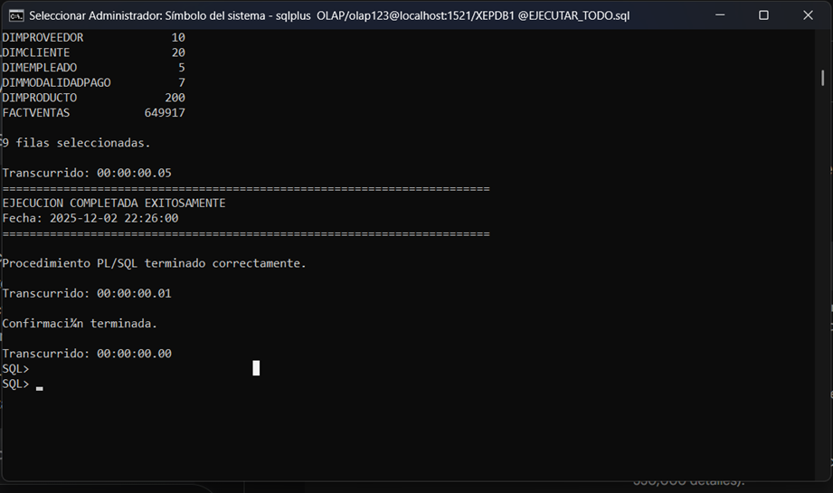

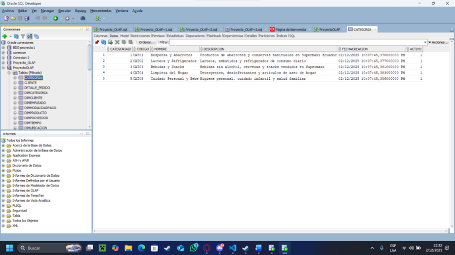
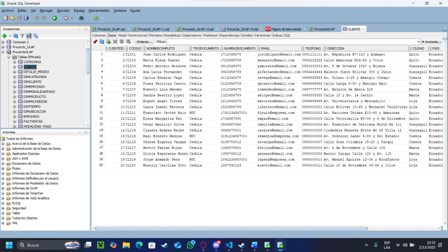

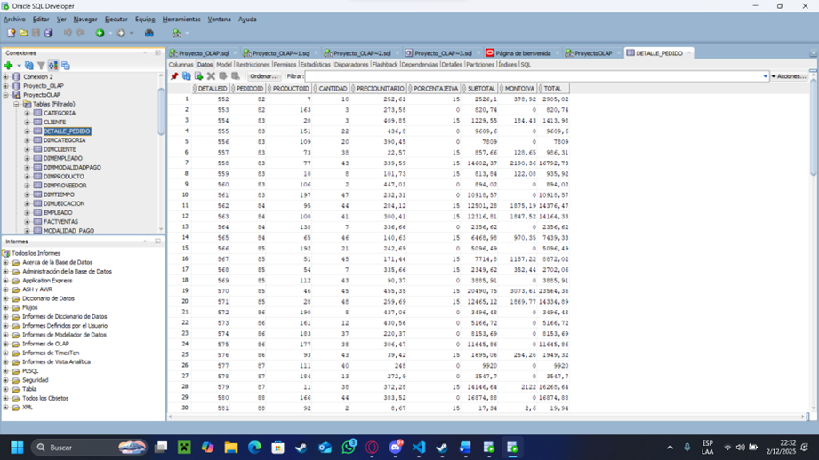

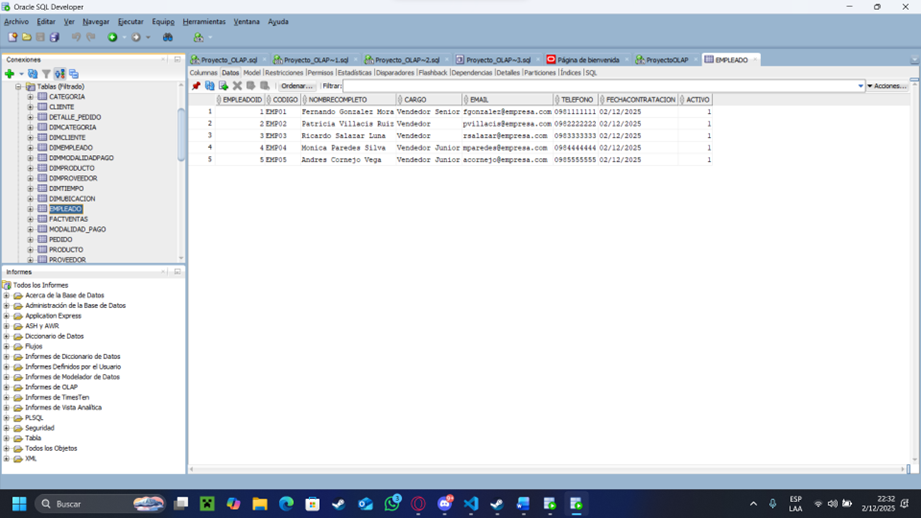
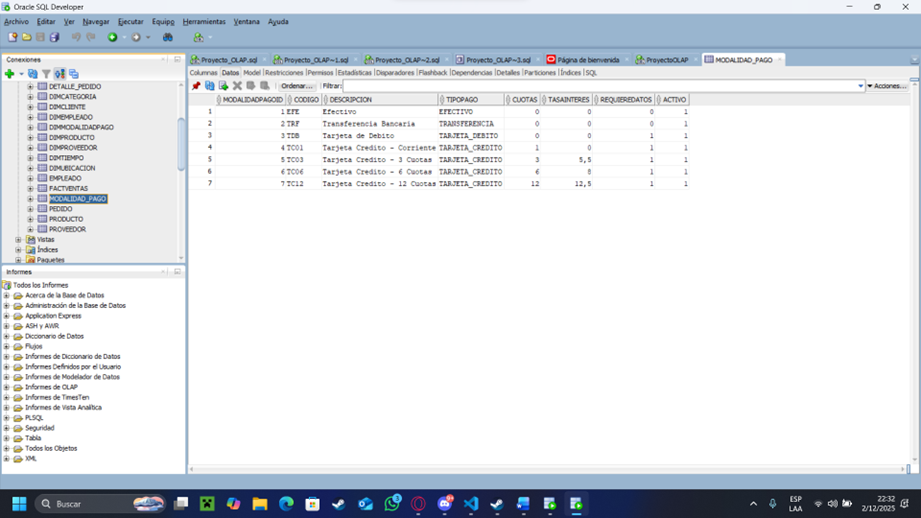
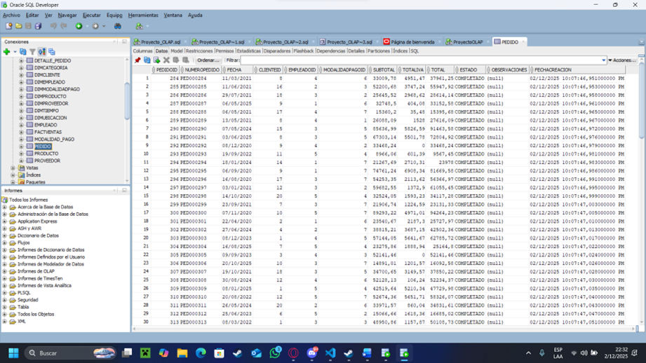
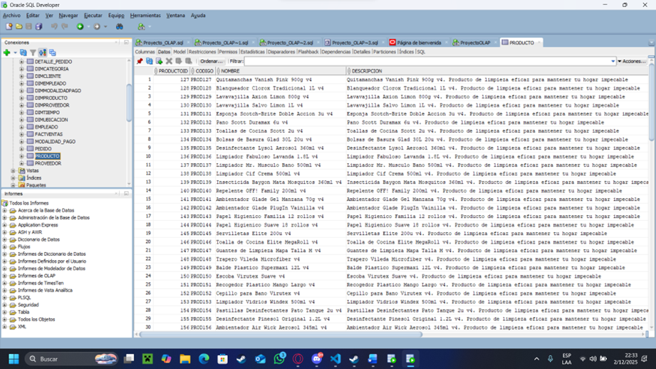
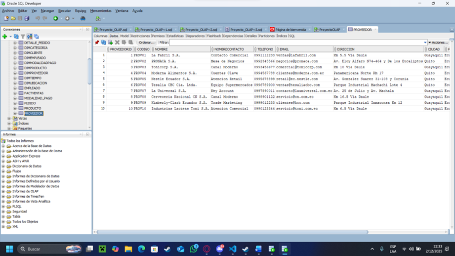
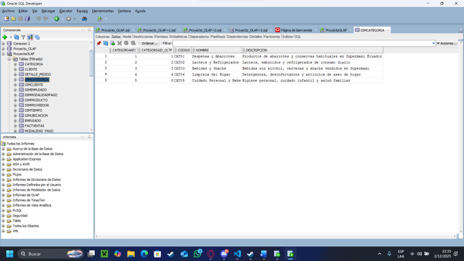
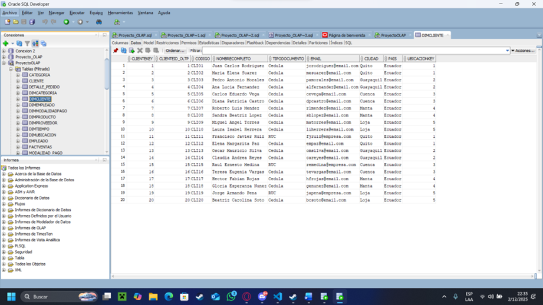
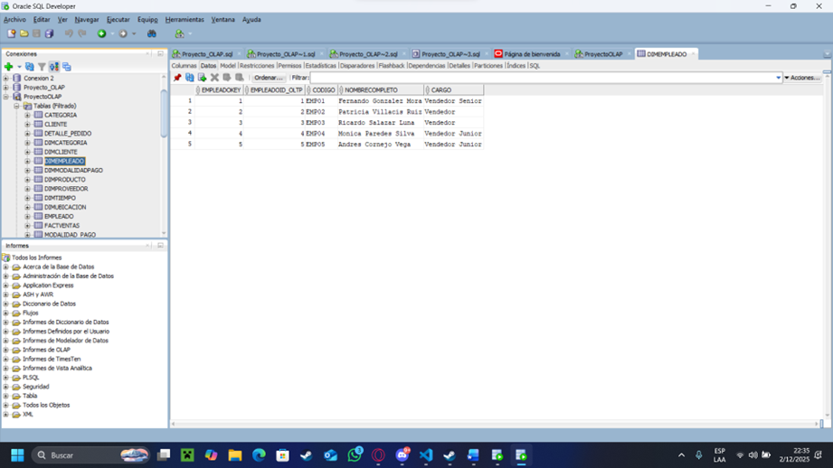
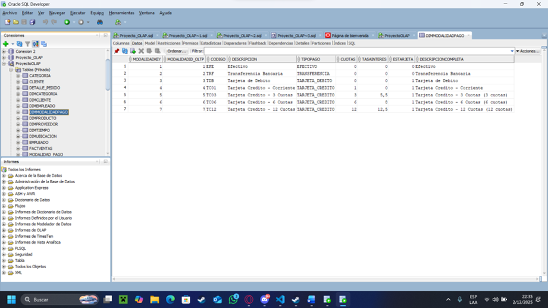
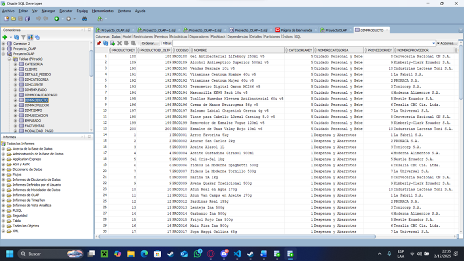
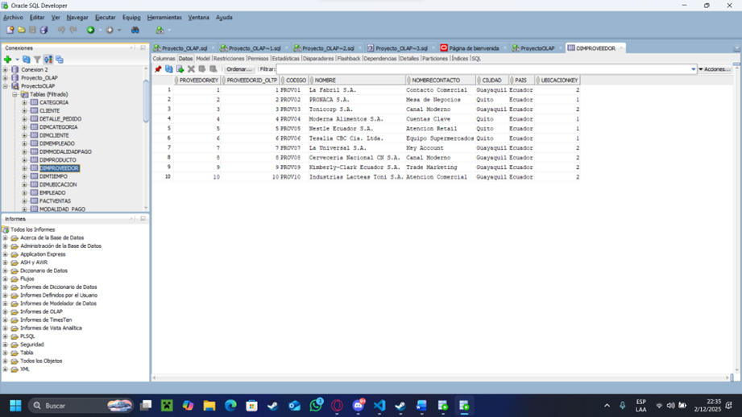
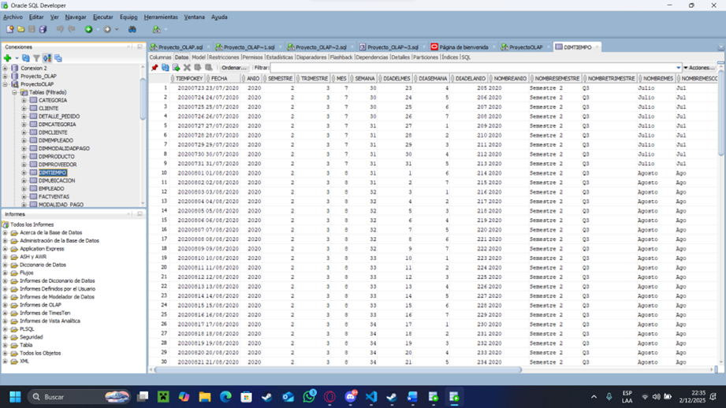
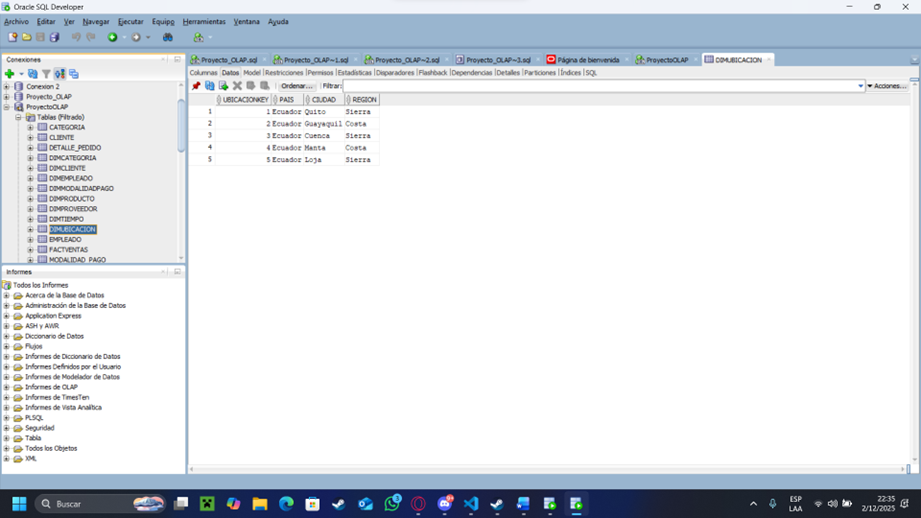
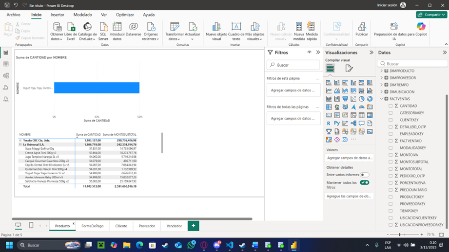

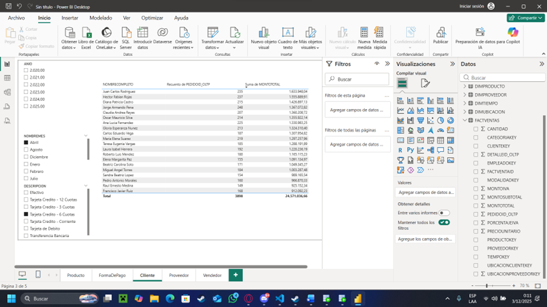
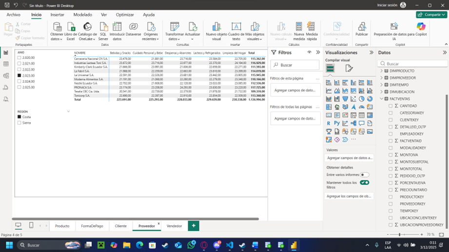

