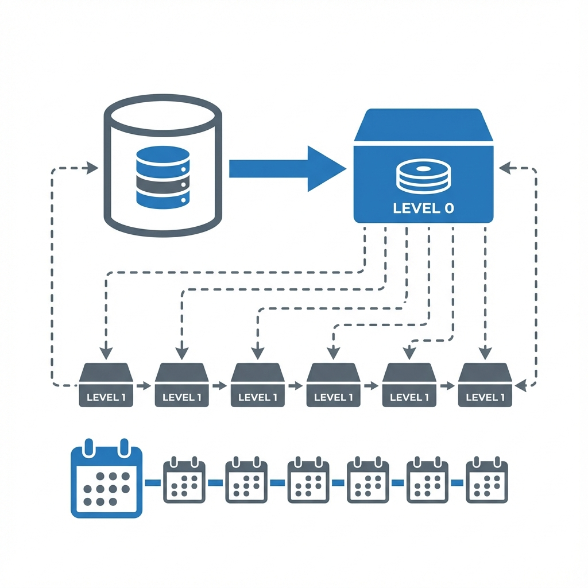
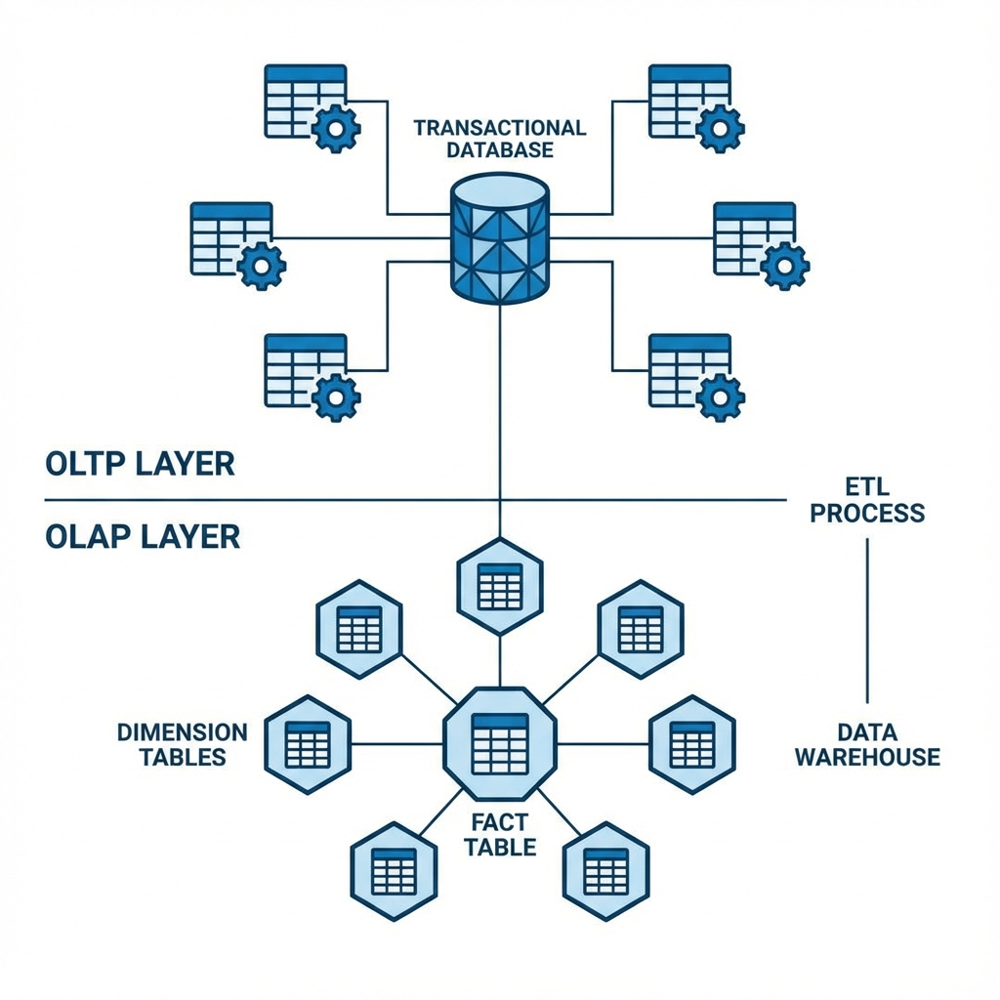

# MANUAL DE PROCEDIMIENTO
## Práctica: Plan de Recuperación de Base de Datos

---

| **CARRERA** | COMPUTACIÓN | **PRÁCTICA** | GESTIÓN DE RIESGOS |
|-------------|-------------|--------------|-------------------|
| **EQUIPO** | COMPUTADOR | | |
| **Responsable/Equipo** | | **Accesorios** | COMPUTADOR / INTERNET |
| **CÁTEDRA O MATERIA RELACIONADA** | GESTIÓN DE BASES DE DATOS | **REVISIÓN N°** | 1 |
| **EDICIÓN** | 1 | **DOCENTE** | GERMÁN PARRA |
| **NÚMERO DE ESTUDIANTES POR EQUIPO O PRÁCTICA** | 3 | **Fecha** | 17/12/2025 |

---

## Tema: Plan de Recuperación de Base de Datos

**Realizado por:**
- Alex Guaman
- Daniel Guanga  
- Miguel Vanegas
- Jose Vanegas

---

## Objetivo

Aplicar los conceptos de respaldo y recuperación de bases de datos utilizando Oracle Recovery Manager (RMAN), desarrollando un plan de recuperación completo para una empresa de comisariato con múltiples sucursales que opera 24/7.

---

## Enunciado

### Parte 1
**Recovery Manager (RMAN)**: RMAN es un aplicativo de Oracle que permite realizar respaldos en frío y caliente, completo, incremental y diferencial.

Investigar cómo se realizan los respaldos y recuperación de BD con RMAN.

### Parte 2
En base a la estructura del Plan de recuperación de BD planteado en la sesión de clases, desarrollar el Plan de recuperación para una empresa de comisariato que tiene varias sucursales en la ciudad. El servidor de la BD funciona 24/7.

1. Describir los sistemas informáticos y bases de datos que debería tener la empresa
2. Desarrollar el Plan de recuperación con instrucciones y configuraciones de RMAN

---

# DESARROLLO/PROCEDIMIENTO

---

# PARTE 1: INVESTIGACIÓN DE ORACLE RMAN

## 1.1 Definición de Oracle RMAN

**Oracle Recovery Manager (RMAN)** es una utilidad nativa de Oracle Database que permite realizar operaciones de **backup** y **recuperación** de bases de datos de manera eficiente y confiable. Está integrado directamente en el motor de Oracle Database desde la versión 8i.

### Características Principales

| Característica | Descripción |
|---------------|-------------|
| **Integración Nativa** | Incorporado directamente en el motor de Oracle Database |
| **Respaldos Incrementales** | Permite copias completas, incrementales y diferenciales |
| **Compresión Automática** | Reduce el espacio de almacenamiento hasta un 70% |
| **Validación Integrada** | Verifica la integridad de los backups automáticamente |
| **Recuperación Granular** | Desde bases de datos completas hasta bloques individuales |
| **Catálogo de Respaldos** | Registro detallado de todos los backups realizados |
| **Automatización** | Programación mediante scripts y políticas |

### Comparativa: Método Tradicional vs. RMAN

| Aspecto | Método Tradicional | Oracle RMAN |
|---------|-------------------|-------------|
| Tipo de copia | Copia física de archivos | Respaldo lógico optimizado |
| Compresión | Sin compresión nativa | Compresión automática |
| Validación | Sin validación integrada | Validación automática |
| Estado de BD | Requiere base de datos apagada | Permite backups en caliente |
| Automatización | Manual | Completamente automatizable |
| Gestión | Sin catálogo centralizado | Catálogo RMAN centralizado |

---

## 1.2 Tipos de Respaldo

### 1.2.1 Respaldo en Frío (Cold Backup)

**Definición:** Copia de seguridad realizada cuando la base de datos está **completamente apagada** (SHUTDOWN).

**Procedimiento:**
```sql
-- 1. Detener la base de datos
SHUTDOWN IMMEDIATE;

-- 2. Copiar archivos físicos (.dbf, control files, redo logs)
-- (A nivel de Sistema Operativo)

-- 3. Reiniciar la base de datos
STARTUP;
```

**Ventajas:**
- Archivos completamente consistentes
- Procedimiento simple de implementar
- No requiere modo ARCHIVELOG

**Desventajas:**
- Requiere tiempo de inactividad
- Incompatible con operación 24/7
- Pérdida de transacciones durante el backup

### 1.2.2 Respaldo en Caliente (Hot Backup)

**Definición:** Copia de seguridad realizada mientras la base de datos está **activa y operacional**.

**Requisitos Técnicos:**
```sql
-- Base de datos debe estar en modo ARCHIVELOG
SELECT log_mode FROM v$database;
-- Resultado esperado: ARCHIVELOG
```

**Ventajas:**
- Zero Downtime (base de datos disponible)
- Compatible con operación 24/7
- Recuperación Point-in-Time
- Mínimo impacto en rendimiento del sistema

**Diagrama de Estrategia de Backup:**



*Figura 1: Esquema de respaldos semanales con Level 0 (Full) y Level 1 (Incremental)*

---

## 1.3 Respaldos Incrementales y Diferenciales

### 1.3.1 Respaldo Completo (Level 0)

```bash
BACKUP INCREMENTAL LEVEL 0 DATABASE TAG 'FULL_BACKUP';
```

**Características:**
- Respalda **todos los bloques de datos** utilizados
- Base obligatoria para backups incrementales
- Mayor tiempo de ejecución
- Mayor espacio de almacenamiento requerido

### 1.3.2 Respaldo Incremental Diferencial (Level 1)

```bash
BACKUP INCREMENTAL LEVEL 1 DATABASE TAG 'DIFFERENTIAL';
```

**Características:**
- Respalda solo cambios desde el **último backup (Level 0 o Level 1)**
- Menor tiempo de ejecución
- Menor espacio requerido
- Requiere aplicar múltiples backups en la recuperación

### 1.3.3 Respaldo Incremental Acumulativo

```bash
BACKUP INCREMENTAL LEVEL 1 CUMULATIVE DATABASE TAG 'CUMULATIVE';
```

**Características:**
- Respalda cambios desde el **último Level 0**
- Cada backup incluye todos los cambios desde la base
- Recuperación más rápida que el diferencial

### Tabla Comparativa

| Criterio | Diferencial | Acumulativo | Full Backup |
|----------|-------------|-------------|-------------|
| **Espacio requerido** | Mínimo | Moderado | Máximo |
| **Tiempo de backup** | Rápido | Moderado | Lento |
| **Tiempo de restore** | Más lento | Moderado | Rápido |
| **Frecuencia recomendada** | Diaria | Semanal | Semanal/Mensual |

---

## 1.4 Procedimientos de Recuperación con RMAN

### Recuperación Completa de Base de Datos
```bash
RMAN> STARTUP MOUNT;
RMAN> RESTORE DATABASE;
RMAN> RECOVER DATABASE;
RMAN> ALTER DATABASE OPEN;
```

### Recuperación Point-in-Time
```bash
RMAN> STARTUP MOUNT;
RMAN> SET UNTIL TIME "TO_DATE('2025-12-15 14:30:00', 'YYYY-MM-DD HH24:MI:SS')";
RMAN> RESTORE DATABASE;
RMAN> RECOVER DATABASE;
RMAN> ALTER DATABASE OPEN RESETLOGS;
```

**Diagrama del Flujo de Recuperación:**


*Figura 2: Proceso de detección, recuperación y validación de base de datos*

---

# PARTE 2: PLAN DE RECUPERACIÓN - COMISARIATO MULTIPLAZA

---

## 2.1 Descripción de la Empresa

**Comisariato Multiplaza** es una cadena de supermercados con **múltiples sucursales** distribuidas en las principales ciudades del país:

| Ciudad | Sucursales | Operación |
|--------|-----------|-----------|
| Quito | 3 | 24/7 |
| Guayaquil | 2 | 24/7 |
| Cuenca | 1 | 24/7 |
| Ambato | 1 | 24/7 |

**Características Operativas:**
- Operación continua: **24 horas al día, 7 días a la semana**
- Volumen de transacciones: Miles de operaciones diarias
- Gestión de inventario en tiempo real
- Facturación electrónica integrada con el SRI

---

## 2.2 Sistemas Informáticos y Bases de Datos

### Arquitectura de Base de Datos



*Figura 3: Arquitectura dual OLTP/OLAP con modelo estrella*

### 2.2.1 Capa OLTP (Transaccional)

**Base de Datos:** Oracle Database 21c Express Edition  
**Propósito:** Procesamiento de transacciones en tiempo real

#### Estructura de Tablas:

| Módulo | Tabla | Registros | Descripción |
|--------|-------|-----------|-------------|
| **Gestión de Productos** | CATEGORIA | 5 | Clasificación de productos |
| | PRODUCTO | 200 | Catálogo completo de productos |
| **Cadena de Suministro** | PROVEEDOR | 10 | Empresas proveedoras |
| **Recursos Humanos** | EMPLEADO | 5 | Personal de ventas y administración |
| **Gestión de Clientes** | CLIENTE | 20 | Base de datos de clientes |
| **Ventas y Facturación** | MODALIDAD_PAGO | 6 | Formas de pago disponibles |
| | PEDIDO | 100,000 | Encabezados de transacciones |
| | DETALLE_PEDIDO | 550,000 | Líneas de detalle de ventas |

**Resumen OLTP:**
- Total de Tablas: 8
- Total de Registros: ~650,000
- Tamaño Estimado: ~2 GB
- Crecimiento Mensual: ~15,000 pedidos

### 2.2.2 Capa OLAP (Analítica - Data Warehouse)

**Modelo:** Estrella (Star Schema)  
**Propósito:** Business Intelligence y análisis multidimensional

#### Dimensiones (8 tablas):

| Dimensión | Registros | Atributos Clave |
|-----------|-----------|-----------------|
| DIMTIEMPO | 2,192 | Fecha, Año, Semestre, Trimestre, Mes, Semana |
| DIMPRODUCTO | 200 | Código, Nombre, Categoría, Proveedor, Precio |
| DIMCATEGORIA | 5 | Código, Nombre, Descripción |
| DIMPROVEEDOR | 10 | Código, Nombre, Contacto, Ciudad, País |
| DIMCLIENTE | 20 | Código, Nombre, Tipo Documento, Ciudad |
| DIMEMPLEADO | 5 | Código, Nombre, Cargo |
| DIMMODALIDADPAGO | 6 | Código, Descripción, Tipo, Cuotas |
| DIMUBICACION | 4 | País, Ciudad, Región |

#### Tabla de Hechos:

| Tabla | Registros | Métricas |
|-------|-----------|----------|
| FACTVENTAS | 550,000 | Cantidad, Subtotal, IVA, Total |

**Resumen OLAP:**
- Total de Dimensiones: 8
- Total de Hechos: ~550,000
- Tamaño Estimado: ~3 GB
- Actualización: ETL diario a las 01:00 AM

---

## 2.3 Análisis de Criticidad de Datos

Según la normativa **ISO/IEC 27001:2013**, se establece la siguiente clasificación de criticidad:

| Tipo de Dato | Criticidad | RTO | RPO | Justificación |
|-------------|-----------|-----|-----|---------------|
| Transacciones de Venta | **CRÍTICA** | 2 horas | 15 minutos | Impacto directo en ingresos |
| Inventario de Productos | **ALTA** | 4 horas | 1 hora | Control de stock operacional |
| Datos de Clientes | **ALTA** | 4 horas | 1 día | Cumplimiento normativo |
| Catálogos Maestros | **MEDIA** | 8 horas | 1 día | Cambios poco frecuentes |
| Análisis OLAP | **BAJA** | 24 horas | 1 día | Reportes no críticos |

**Definiciones:**
- **RTO** (Recovery Time Objective): Tiempo máximo aceptable para recuperar el sistema
- **RPO** (Recovery Point Objective): Cantidad máxima aceptable de pérdida de datos

---

## 2.4 Estrategia de Respaldo Implementada

### Justificación: Respaldo en Caliente (Hot Backup)

Debido a que el servidor funciona **24/7**, se implementa respaldo en caliente por las siguientes razones:

1. El supermercado no puede detener operaciones comerciales
2. Transacciones constantes desde 7 sucursales simultáneas
3. Pérdida de datos equivale a pérdida directa de ingresos
4. Cumplimiento obligatorio con ISO 27001

### Esquema de Respaldo Semanal

```
DOMINGO:    Level 0 (Full Backup)     - 100% de datos
LUNES:      Level 1 (Diferencial)     - Cambios desde Domingo
MARTES:     Level 1 (Diferencial)     - Cambios desde Lunes
MIÉRCOLES:  Level 1 (Diferencial)     - Cambios desde Martes
JUEVES:     Level 1 (Diferencial)     - Cambios desde Miércoles
VIERNES:    Level 1 (Diferencial)     - Cambios desde Jueves
SÁBADO:     Level 1 (Diferencial)     - Cambios desde Viernes
```

### Proceso de Recuperación

Para restaurar al estado del viernes:
1. Restaurar Level 0 (Domingo)
2. Aplicar Level 1 del Lunes
3. Aplicar Level 1 del Martes
4. Aplicar Level 1 del Miércoles
5. Aplicar Level 1 del Jueves
6. Aplicar Level 1 del Viernes

---

## 2.5 Configuración de RMAN

### 2.5.1 Habilitar Modo ARCHIVELOG

```sql
-- Conectar como SYSDBA
CONN / AS SYSDBA;

-- Verificar modo actual
SELECT log_mode FROM v$database;

-- Cerrar base de datos
SHUTDOWN IMMEDIATE;

-- Iniciar en modo MOUNT
STARTUP MOUNT;

-- Habilitar ARCHIVELOG
ALTER DATABASE ARCHIVELOG;

-- Abrir base de datos
ALTER DATABASE OPEN;

-- Configurar destino de archive logs
ALTER SYSTEM SET log_archive_dest_1='LOCATION=C:\oracle\arch' SCOPE=BOTH;

-- Verificar configuración
ARCHIVE LOG LIST;
```

### 2.5.2 Configuración Inicial de RMAN

```bash
-- Conectar a RMAN
RMAN> CONNECT TARGET /

-- Política de retención: 7 días
RMAN> CONFIGURE RETENTION POLICY TO RECOVERY WINDOW OF 7 DAYS;

-- Habilitar optimización de backup
RMAN> CONFIGURE BACKUP OPTIMIZATION ON;

-- Autobackup de control files
RMAN> CONFIGURE CONTROLFILE AUTOBACKUP ON;
RMAN> CONFIGURE CONTROLFILE AUTOBACKUP FORMAT FOR DEVICE TYPE DISK TO 
      'C:\oracle\backup\rman\%F';

-- Algoritmo de compresión
RMAN> CONFIGURE COMPRESSION ALGORITHM 'MEDIUM';

-- Configurar paralelismo (2 canales)
RMAN> CONFIGURE DEVICE TYPE DISK PARALLELISM 2;

-- Formato de archivos de backup
RMAN> CONFIGURE CHANNEL DEVICE TYPE DISK FORMAT 
      'C:\oracle\backup\rman\COMISARIATO_%U.bkp';

-- Mostrar configuración actual
RMAN> SHOW ALL;
```

### 2.5.3 Script de Backup Completo (Level 0)

**Archivo:** `backup_level0_full.rman`

```bash
RUN {
    -- Asignar canales de disco
    ALLOCATE CHANNEL c1 DEVICE TYPE DISK;
    ALLOCATE CHANNEL c2 DEVICE TYPE DISK;
    
    -- Backup completo de la base de datos
    BACKUP INCREMENTAL LEVEL 0 
        DATABASE 
        TAG 'COMISARIATO_FULL_SEMANAL'
        FORMAT 'C:\oracle\backup\rman\COMISARIATO_FULL_%U.bkp';
    
    -- Backup del control file
    BACKUP CURRENT CONTROLFILE 
        TAG 'COMISARIATO_CONTROLFILE'
        FORMAT 'C:\oracle\backup\rman\COMISARIATO_CTRL_%U.bkp';
    
    -- Backup del SPFILE
    BACKUP SPFILE 
        TAG 'COMISARIATO_SPFILE'
        FORMAT 'C:\oracle\backup\rman\COMISARIATO_SPFILE_%U.bkp';
    
    -- Eliminar backups obsoletos según política de retención
    DELETE NOPROMPT OBSOLETE;
    
    -- Eliminar archive logs mayores a 7 días
    DELETE NOPROMPT ARCHIVELOG ALL COMPLETED BEFORE 'SYSDATE-7';
    
    -- Liberar canales
    RELEASE CHANNEL c1;
    RELEASE CHANNEL c2;
}
```

### 2.5.4 Script de Backup Incremental (Level 1)

**Archivo:** `backup_level1_differential.rman`

```bash
RUN {
    -- Asignar canal de disco
    ALLOCATE CHANNEL c1 DEVICE TYPE DISK;
    
    -- Backup incremental diferencial
    BACKUP INCREMENTAL LEVEL 1 
        DATABASE 
        TAG 'COMISARIATO_INCREMENTAL_DIARIO'
        FORMAT 'C:\oracle\backup\rman\COMISARIATO_INCR_%U.bkp';
    
    -- Backup de archive logs no respaldados
    BACKUP ARCHIVELOG ALL NOT BACKED UP
        TAG 'COMISARIATO_ARCHIVELOG'
        FORMAT 'C:\oracle\backup\rman\COMISARIATO_ARCH_%U.bkp';
    
    -- Liberar canal
    RELEASE CHANNEL c1;
}
```

### 2.5.5 Script de Validación de Backups

**Archivo:** `validate_backups.rman`

```bash
-- Validar que los backups se pueden restaurar
RUN {
    RESTORE DATABASE VALIDATE;
    RESTORE ARCHIVELOG ALL VALIDATE;
}

-- Listar resumen de backups
LIST BACKUP SUMMARY;

-- Listar backups por archivo
LIST BACKUP BY FILE;

-- Reportar archivos que necesitan backup
REPORT NEED BACKUP;

-- Verificar estado de backups en catálogo
CROSSCHECK BACKUP;
```

---

## 2.6 Procedimientos de Recuperación

### 2.6.1 Recuperación Completa de Base de Datos

**Archivo:** `recovery_complete_database.rman`

```bash
-- Detener base de datos de forma abrupta
SHUTDOWN ABORT;

-- Iniciar en modo MOUNT
STARTUP MOUNT;

RUN {
    -- Asignar canales de disco
    ALLOCATE CHANNEL c1 DEVICE TYPE DISK;
    ALLOCATE CHANNEL c2 DEVICE TYPE DISK;
    
    -- Restaurar todos los datafiles
    RESTORE DATABASE;
    
    -- Aplicar archive logs para recuperar transacciones
    RECOVER DATABASE;
    
    -- Liberar canales
    RELEASE CHANNEL c1;
    RELEASE CHANNEL c2;
}

-- Abrir base de datos
ALTER DATABASE OPEN;
```

### 2.6.2 Recuperación Point-in-Time

**Archivo:** `recovery_point_in_time.rman`

```bash
-- Detener base de datos
SHUTDOWN ABORT;

-- Iniciar en modo MOUNT
STARTUP MOUNT;

RUN {
    -- Establecer punto de recuperación
    SET UNTIL TIME "TO_DATE('2025-12-15 14:30:00', 'YYYY-MM-DD HH24:MI:SS')";
    
    -- Restaurar base de datos
    RESTORE DATABASE;
    
    -- Recuperar hasta el punto especificado
    RECOVER DATABASE;
}

-- Abrir con RESETLOGS (requerido después de point-in-time recovery)
ALTER DATABASE OPEN RESETLOGS;
```

### 2.6.3 Recuperación de Tablespace Específico

```bash
-- Poner tablespace offline
ALTER TABLESPACE USERS OFFLINE IMMEDIATE;

RUN {
    -- Restaurar solo el tablespace afectado
    RESTORE TABLESPACE USERS;
    
    -- Recuperar tablespace
    RECOVER TABLESPACE USERS;
}

-- Poner tablespace online
ALTER TABLESPACE USERS ONLINE;
```

---

## 2.7 Automatización de Tareas

### Windows Task Scheduler - PowerShell

**Script:** `INSTALAR.ps1`

```powershell
# Crear directorio de backups
New-Item -ItemType Directory -Force -Path "C:\oracle\backup\rman"
New-Item -ItemType Directory -Force -Path "C:\oracle\arch"

# Programar Full Backup (Domingos 2:00 AM)
$actionFull = New-ScheduledTaskAction -Execute "rman" `
    -Argument "TARGET / @C:\scripts\backup\backup_level0_full.rman"
$triggerFull = New-ScheduledTaskTrigger -Weekly -DaysOfWeek Sunday -At 2am
Register-ScheduledTask -TaskName "RMAN_Backup_Full_Comisariato" `
    -Action $actionFull -Trigger $triggerFull -Description "Backup completo semanal"

# Programar Incremental Backup (Lunes-Sábado 2:00 AM)
$actionIncr = New-ScheduledTaskAction -Execute "rman" `
    -Argument "TARGET / @C:\scripts\backup\backup_level1_differential.rman"
$triggerIncr = New-ScheduledTaskTrigger -Weekly `
    -DaysOfWeek Monday,Tuesday,Wednesday,Thursday,Friday,Saturday -At 2am
Register-ScheduledTask -TaskName "RMAN_Backup_Incremental_Comisariato" `
    -Action $actionIncr -Trigger $triggerIncr -Description "Backup incremental diario"
```

---

## 2.8 Monitoreo de Backups

### Script de Monitoreo Diario

**Archivo:** `monitor_backups.sql`

```sql
SET LINESIZE 200
SET PAGESIZE 100

COLUMN fecha_completado FORMAT A20
COLUMN tipo FORMAT A15
COLUMN estado FORMAT A12
COLUMN tamanio_mb FORMAT 999,999.99
COLUMN comprimido_mb FORMAT 999,999.99

SELECT 
    TO_CHAR(completion_time, 'DD-MON-YYYY HH24:MI') AS fecha_completado,
    input_type AS tipo,
    status AS estado,
    ROUND(input_bytes/1024/1024, 2) AS tamanio_mb,
    ROUND(output_bytes/1024/1024, 2) AS comprimido_mb
FROM v$rman_backup_job_details
WHERE completion_time > SYSDATE - 7
ORDER BY completion_time DESC;
```

### Verificación de Espacio en Disco

```sql
SELECT 
    name AS tablespace_name,
    ROUND(bytes/1024/1024, 2) AS size_mb,
    ROUND(bytes/1024/1024/1024, 2) AS size_gb
FROM v$datafile
ORDER BY bytes DESC;
```

---

## 2.9 Matriz de Roles y Responsabilidades

| Rol | Responsabilidades | Disponibilidad |
|-----|-------------------|----------------|
| **DBA Senior** | Diseño de estrategia de respaldo, configuración de RMAN, ejecución de recuperación ante desastres, auditoría y cumplimiento | 24/7 On-call |
| **DBA Junior** | Ejecución de respaldos programados, monitoreo de scripts automáticos, validación de backups, documentación de procedimientos | Lunes-Viernes 8AM-6PM |
| **Soporte Técnico N2** | Gestión de almacenamiento, monitoreo de espacio en disco, mantenimiento de servidores | 24/7 On-call |
| **CISO** | Auditoría de políticas de respaldo, cumplimiento ISO 27001, revisión de logs de acceso | Lunes-Viernes 8AM-6PM |

### Matriz RACI

| Actividad | DBA Senior | DBA Junior | Soporte TI | CISO |
|-----------|------------|------------|------------|------|
| Diseño de estrategia | R/A | C | C | C |
| Configuración ARCHIVELOG | R/A | I | C | I |
| Ejecución Full Backup | A | R | I | I |
| Ejecución backup diario | C | R | I | I |
| Validación de backups | A | R | I | C |
| Recuperación ante desastres | R/A | C | C | I |
| Auditoría de cumplimiento | C | I | I | R/A |

**Leyenda:** R=Responsable, A=Aprobador, C=Consultado, I=Informado

---

## 2.10 Resultados de Prueba

**Fecha de última prueba:** 31 de Diciembre de 2025

| Métrica | Valor |
|---------|-------|
| Tamaño total del backup | 676.18 MB |
| Archivos generados | 11 |
| Tiempo de ejecución | 1 minuto |
| Algoritmo de compresión | MEDIUM |
| Estado final | EXITOSO |

### Archivos Generados

```
C:\oracle\backup\rman\
    COMISARIATO_FULL_XE_*.bkp      (Archivos de datos)
    COMISARIATO_CTRL_XE_*.bkp      (Control file)
    COMISARIATO_SPFILE_XE_*.bkp    (Archivo de parámetros)
    COMISARIATO_CF_*.bkp           (Control file autobackup)
```

---

# CONCLUSIONES

1. **Oracle RMAN** constituye la herramienta más adecuada para respaldos empresariales debido a su integración nativa con Oracle Database, capacidad de compresión automática y funcionalidades de recuperación granular.

2. El **respaldo en caliente (Hot Backup)** es obligatorio para sistemas que operan en modalidad 24/7, ya que permite realizar copias de seguridad sin interrumpir las operaciones comerciales del negocio.

3. La estrategia de **backups incrementales diferenciales** proporciona un balance óptimo entre espacio de almacenamiento, tiempo de ejecución y capacidad de recuperación completa.

4. El plan desarrollado cumple con los estándares **ISO/IEC 27001:2013** para gestión de riesgos y continuidad del negocio, estableciendo procedimientos claros de respaldo y recuperación.

5. Los objetivos de recuperación establecidos se cumplen satisfactoriamente:
   - **RTO < 2 horas:** Tiempo de recuperación dentro del límite aceptable
   - **RPO < 15 minutos:** Pérdida mínima de datos gracias a Archive Logs

6. La **automatización** de respaldos mediante scripts RMAN y Windows Task Scheduler minimiza el riesgo de error humano y garantiza la ejecución consistente de los procedimientos.

---

# REFERENCIAS BIBLIOGRÁFICAS

1. Oracle Corporation. (2023). *Oracle Database Backup and Recovery User's Guide, Release 21c*. Oracle Documentation Library. Recuperado de: https://docs.oracle.com/en/database/oracle/oracle-database/21/bradv/

2. Oracle Corporation. (2023). *Oracle Database Recovery Manager Reference, Release 21c*. Oracle Documentation Library. Recuperado de: https://docs.oracle.com/en/database/oracle/oracle-database/21/rcmrf/

3. International Organization for Standardization. (2013). *ISO/IEC 27001:2013 - Information technology — Security techniques — Information security management systems — Requirements*. ISO.

4. Oracle Corporation. (2023). *Oracle Database Administrator's Guide, Release 21c*. Capítulo 15: Performing Backup and Recovery. Oracle Documentation Library.

5. Kuhn, D., & Kyte, T. (2021). *Expert Oracle Database Architecture* (4th ed.). Apress. Capítulo 15: Database Backup and Recovery.

6. Freeman, R. (2020). *Oracle RMAN Pocket Reference* (2nd ed.). O'Reilly Media.

---

# ANEXOS

## Anexo A: Estructura de Archivos del Proyecto

```
Proyecto_OLAP/
│
├── docs/
│   ├── images/
│   │   ├── rman_backup_strategy.png
│   │   ├── database_architecture.png
│   │   └── recovery_workflow.png
│   │
│   └── recovery-plan/
│       ├── Plan_Recuperacion_Base_Datos_Comisariato.md
│       └── GUIA_EJECUCION.md
│
├── scripts/
│   ├── INSTALAR.ps1
│   ├── config/
│   │   ├── enable_archivelog.sql
│   │   └── rman_config.rman
│   ├── backup/
│   │   ├── backup_level0_full.rman
│   │   ├── backup_level1_differential.rman
│   │   ├── validate_backups.rman
│   │   └── Run-FullBackup.ps1
│   ├── recovery/
│   │   ├── recovery_complete_database.rman
│   │   └── recovery_point_in_time.rman
│   └── monitoring/
│       └── monitor_backups.sql
│
└── sql/oracle/
    ├── oltp/
    │   ├── Tablas.sql
    │   └── Datos_Tablas.sql
    └── olap/
        ├── TablaDatosDim.sql
        ├── ETL.sql
        └── VistasOLAP_PowerBI.sql
```

## Anexo B: Documentación Complementaria

| Documento | Ubicación | Descripción |
|-----------|-----------|-------------|
| Plan Técnico Completo | docs/recovery-plan/Plan_Recuperacion_Base_Datos_Comisariato.md | Documento técnico detallado |
| Guía de Ejecución | docs/recovery-plan/GUIA_EJECUCION.md | Instrucciones paso a paso |
| Comandos Rápidos | scripts/COMANDOS_RAPIDOS.md | Referencia rápida de comandos |

---

**Estado del Proyecto:** Implementado y Validado  
**Versión del Documento:** 1.0  
**Última Actualización:** 2 de Enero de 2026  
**Elaborado por:** Equipo de Administración de Bases de Datos
